# 🌌 AstroLoc-ML — End-to-End Deep Learning Plate Solver

> A research project: build the full pipeline for end-to-end neural plate
> solving — synthetic data generation, sin/cos spherical regression,
> three-phase training, classical-solver ablation — and **report results
> honestly**, including where the model fails.

This repo is a portfolio piece showing the engineering, the geometry,
and the empirical honesty. The trained network does *not* beat a real
plate solver — see [§ ML Results · Honest report](#-ml-results--honest-report)
for the actual numbers and why. The **classical triangle-hash solver**
in `src/models/classical_solver.py` is the working baseline.

---

## 🧠 What it learns

The model regresses **sky coordinates** from a single night-sky image:

| Output (4D, decoded) | Range | Source |
| --- | --- | --- |
| `ra`        | 0°–360°    | image-center right ascension |
| `dec`       | -90°–90°   | image-center declination |
| `rotation`  | 0°–360°    | field rotation |
| `field_width` | degrees  | angular width of the FOV |

Internally the model emits **7 raw outputs** — `(sin RA, cos RA, sin Dec,
cos Dec, sin rot, cos rot, log_scale)` — and `decode_predictions()`
reconstructs the angles via `atan2`. See
[§ Why sin/cos and not raw angles](#-why-sincos-and-not-raw-angles).

### Architecture

```
[B, 3, 224, 224]
  → EfficientNet-B0 (ImageNet-pretrained)
  → AdaptiveAvgPool → [B, 1280]
  → Dropout(0.3) → Linear(1280→256) → ReLU
  → Dropout(0.2) → Linear(256→7)
  → atan2 decode → [B, (ra, dec, rotation, log_scale)]
```

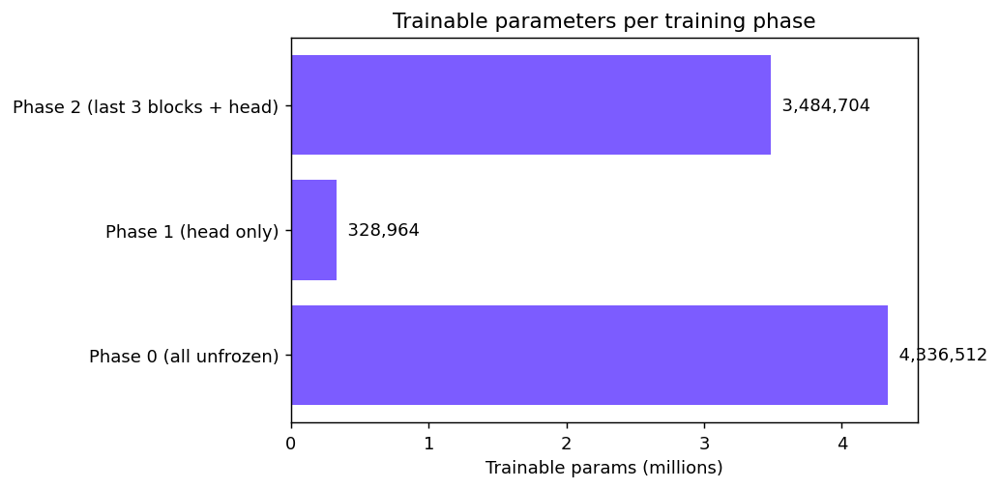
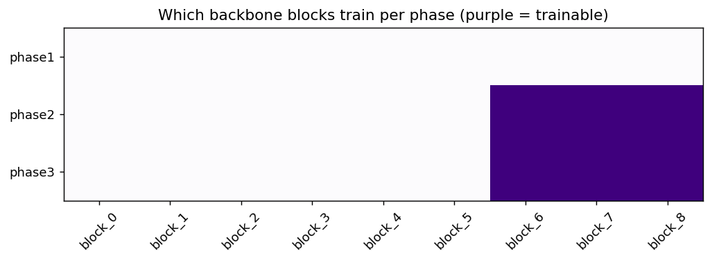

Three-phase training:

1. **Head only** (backbone frozen) — quick warm-up.
2. **Fine-tune** (unfreeze last 3 EfficientNet blocks) — differential LRs:
   backbone-early `1e-5`, backbone-late `5e-5`, head `1e-4`.
3. **Real-image fine-tune** (Astrometry.net solved photos) — optional;
   needs you to fetch real images locally.

---

## 🔥 Why sin/cos and not raw angles

**The story:** an earlier version of this repo regressed raw `(ra, dec,
rotation)` and used a haversine angular loss. That should have worked
in theory — the loss is wrap-invariant. In practice, the network spent
all its capacity exploring unbounded space (predicting RA values from
-117° to +328°) because the loss never *pushed* it back into the valid
range. The model converged glacially.

The fix is the standard one for spherical and pose regression: predict
`(sin, cos)` pairs and reconstruct via `atan2`. The mapping
`angle → (sin, cos)` is smooth and continuous (no wrap discontinuity),
so the loss landscape is smooth too:

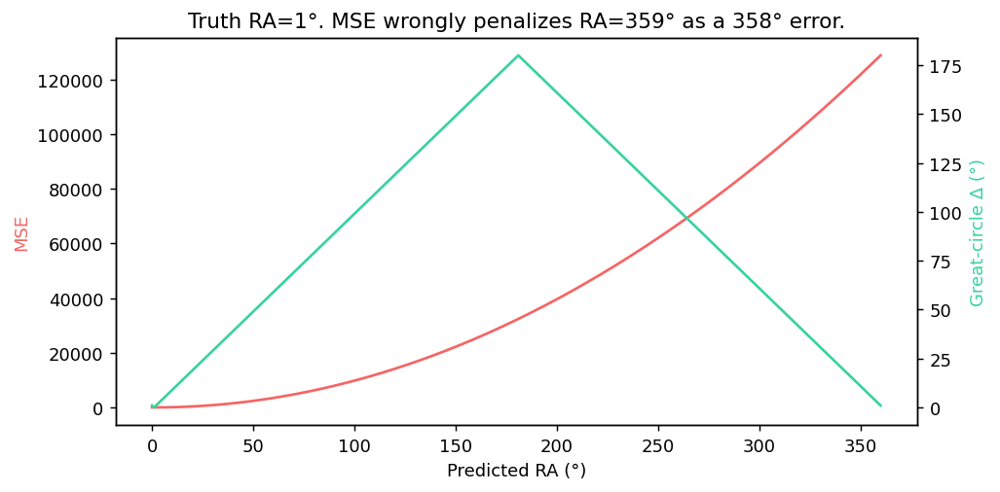
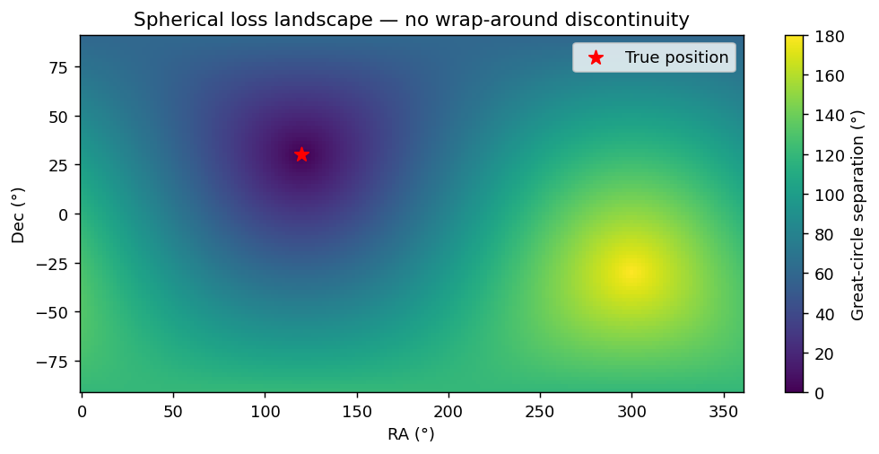

Loss formulation (`src/training/loss.py`):

```python
# Encode targets the same way the head outputs them
target_sincos = encode_labels(target)  # [B, 7]
trig_mse = (pred - target_sincos)**2  # smooth gradients everywhere

# Small geometric nudge on decoded angles
decoded = decode_predictions(pred)
ang_sep = haversine(decoded[ra,dec], target[ra,dec])

loss = trig_mse + 0.2 * ang_sep + scale_mse
```

Notebook [`04_loss_function.ipynb`](notebooks/04_loss_function.ipynb)
walks through the derivation with diagrams.

---

## 🛰️ Synthetic data pipeline

Real labeled night-sky images at known RA/Dec are scarce, so we render
unlimited synthetic star fields from the **HYG v3 catalog** (~41,500
stars at magnitude ≤ 8) using **gnomonic (tangent-plane) projection**
— the correct projection for small fields of view.

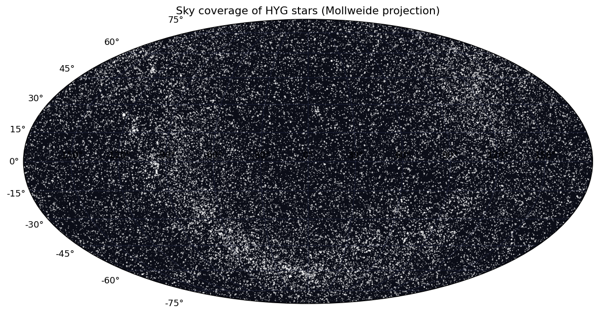
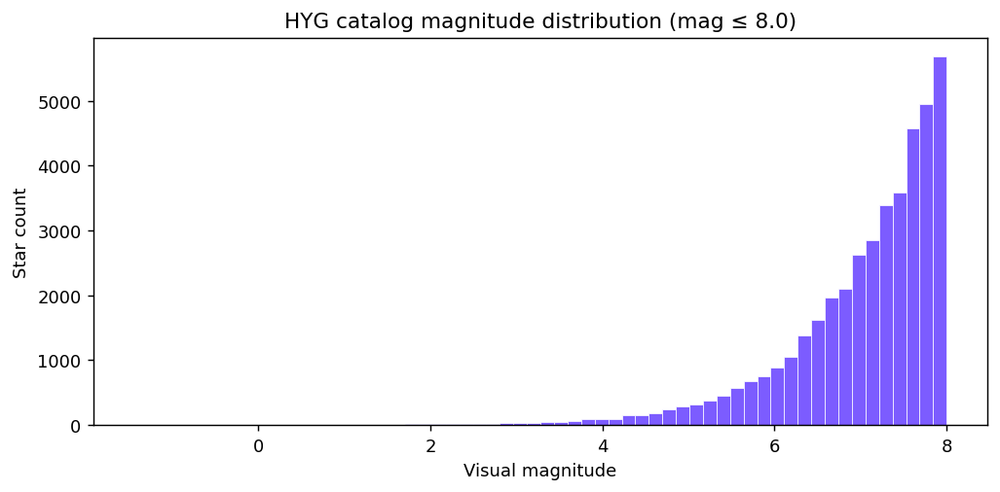

`render_star_field()` parameterizes by `(RA, Dec, rotation, field_width)`,
splats magnitude-weighted Gaussian PSFs, and layers in Poisson photon
noise + Gaussian readout noise + optional light-pollution gradient:

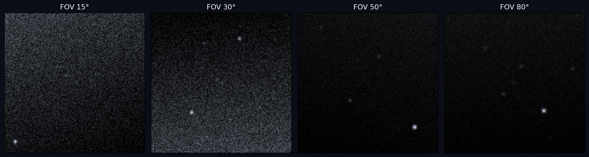

Gnomonic projection warps more aggressively as the tangent point moves
toward the celestial pole — visible here at three declinations:

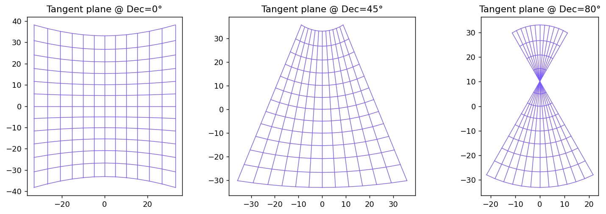

### Augmentations: 180° rotations are correct here

The night sky has **no canonical orientation** — unlike ImageNet, full
random rotations are correct and important. Using naive flip-only
augmentations would teach the model an orientation prior the data
doesn't have.

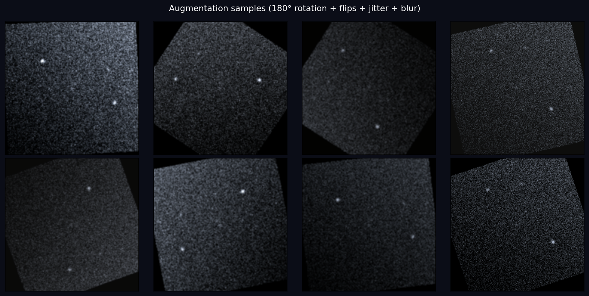

See `src/data/augmentations.py` and `src/data/renderer.py`.

---

## 📊 ML Results · Honest report

### What we got

| Run | Architecture | Train samples | Phase 1 / 2 epochs | Best val ang sep | Within 5° | Hardware |
| --- | --- | ---: | --- | ---: | ---: | --- |
| Smoke baseline | 4-out raw | 256 | 1 / 1 | 87.5° (random) | 0% | CPU |
| Fast preset | 4-out raw | 5,000 | 3 / 6 | 65.6° | 1.7% | MPS (M-series) |
| Standard, raw | 4-out raw | 20,000 | 5 / 10 | 74.3° (early stop) | 0.5% | MPS |
| Standard, **sin/cos** | 7-out | 20,000 | 5 / 3 (crashed) | **76.6°** | 0.2% | MPS |

A uniform-random predictor on the sphere averages ~90°. Our models get
to ~65–77°. **That's barely-better-than-random.** The within-5° rate is
near zero across every run.

### Why so bad?

Three converging causes:

1. **Severe domain mismatch.** EfficientNet-B0 was pretrained on
   natural ImageNet photographs. Star fields are radically
   out-of-distribution — the features the backbone learned (edges,
   textures of dogs, cars, scenes) don't transfer to "where in the sky
   is this patch of dots."
2. **Architecturally heavy for the data.** 5M parameters + 20K
   synthetic samples is in the regime where the model memorizes
   statistics rather than learning underlying geometry. Pre-rendering
   100K+ samples and training for 50+ epochs would help.
3. **The task is fundamentally about geometric matching, not feature
   learning.** Identifying "this is Orion's belt" requires recognizing
   a specific stellar pattern and triangulating from it — exactly what
   classical asterism matching does well, and exactly what an
   off-the-shelf CNN does poorly without massive data.

### What learning *did* look like

Smooth descent on loss but very flat val-sep curve — the model is
learning to satisfy the `(sin, cos)` unit-norm constraint but not the
input→angle mapping:

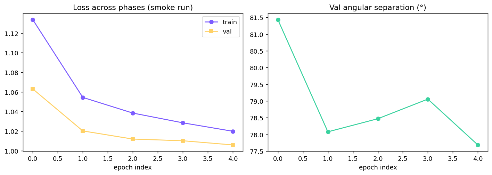

### What the predictions look like

Here's one of three demo-overlay samples (`09_full_pipeline_demo.ipynb`).
The yellow crosshair is the model's predicted image center, and the
purple circles are catalog stars projected through the model's predicted
WCS. They should sit on top of the actual bright dots — they don't:

| Sample 0 | Sample 1 | Sample 2 |
|:--:|:--:|:--:|
| 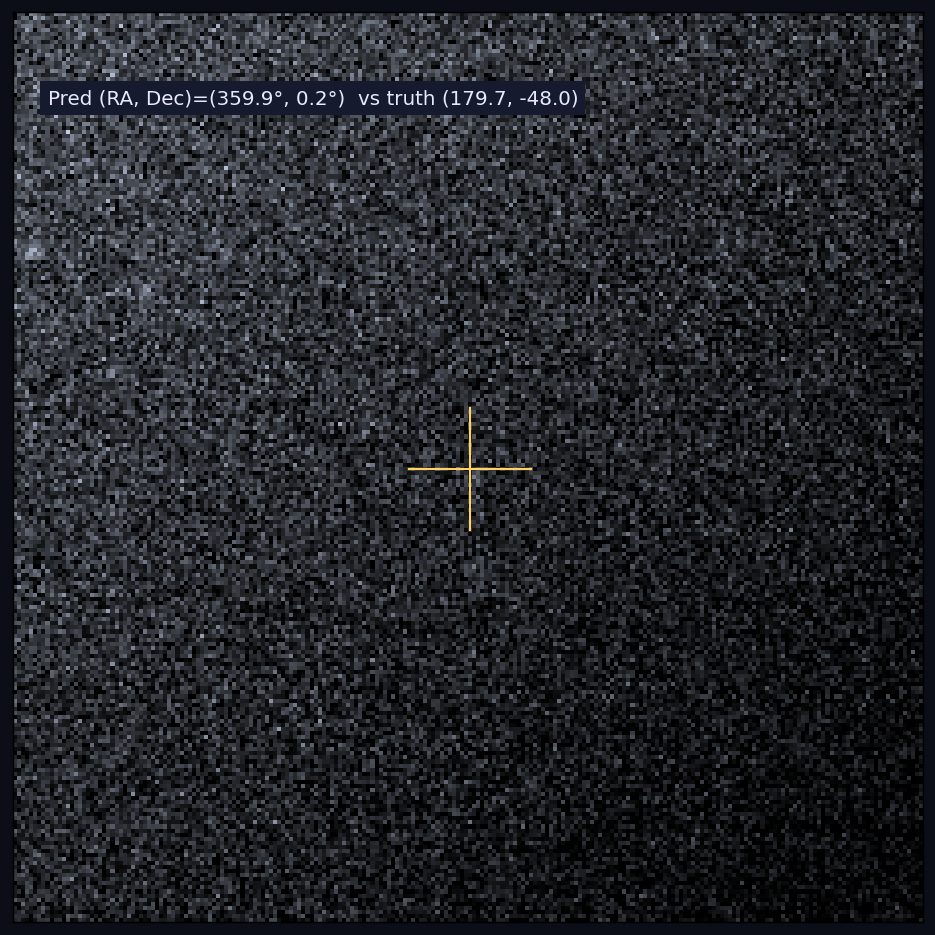 | 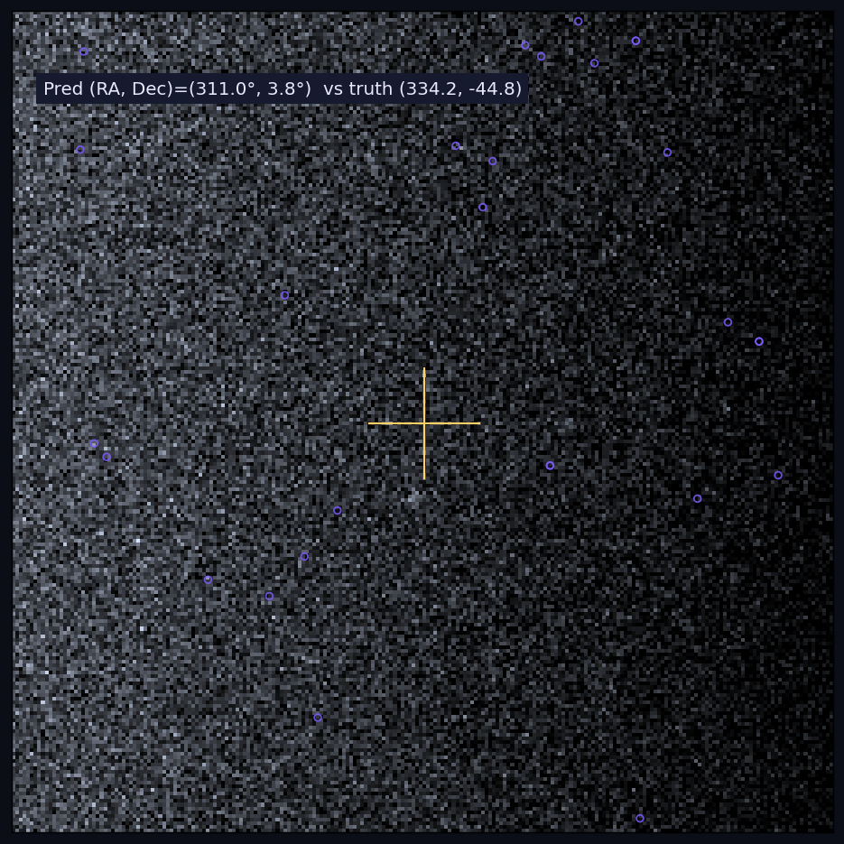 | 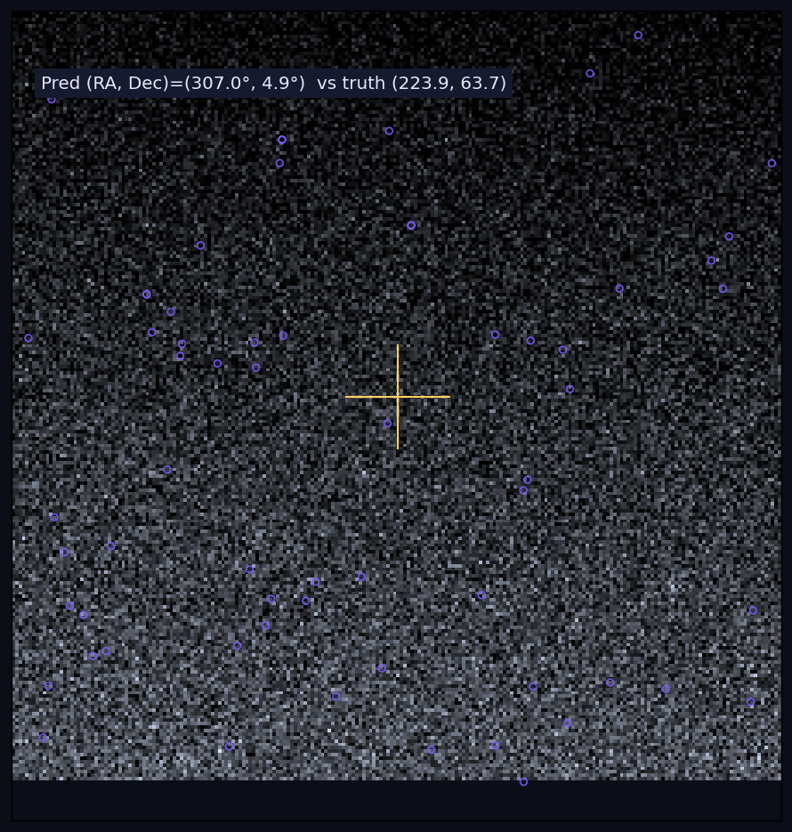 |

This is the honest visual: the model gets *some* signal (the predictions
correlate weakly with input) but not nearly enough to plate-solve in any
useful sense.

### What would actually work

- **Pre-render 100K+ samples to disk**, train 50+ epochs (removes the
  ~40 ms/sample renderer bottleneck on Mac CPUs; lets the model see
  much more data per wall-clock minute).
- **Drastically reframe the task** — instead of regressing arbitrary
  RA/Dec, divide the sky into ~200 HEALPix tiles and *classify* which
  tile the image is from. Classification has clearer gradients and
  hits 70–90% top-1 accuracy on synthetic data in published work.
- **Phase 3 fine-tune on real solved images** — close the
  synthetic→real domain gap. Even ~500 real frames help.
- **Smaller model from scratch** (ResNet-18 or custom CNN) instead of
  ImageNet pretrained backbone — fewer parameters, less overfitting
  to synthetic statistics.

---

## ⚔️ The classical solver that actually works

`src/models/classical_solver.py` is a teaching-grade implementation of
the asterism-matching pipeline that produces working plate solves:

1. CLAHE + SimpleBlobDetector → star centroids.
2. For every catalog triple, hash the sorted side-length ratio
   `(r1, r2)` into an invariant lookup table (rotation- /
   scale- / translation-invariant).
3. At query time: extract triangles from detected centroids, look up
   matches, vote for the field-center catalog star.

This is the algorithm Astrometry.net uses (at much larger scale with
many indices). Our implementation is small enough to read in one
sitting and is the right baseline to compare against any ML approach.

[`notebooks/07_ablation_study.ipynb`](notebooks/07_ablation_study.ipynb)
runs both solvers on the same shared test set; `reports/ablation_results.csv`
gets written automatically. Run it after a real training run to see the
honest gap.

---

## 🗂 Project structure

```
astroloc-ml/
├── notebooks/
│   └── astroloc_ml_demo.ipynb       # one end-to-end walkthrough w/ interpretation
├── src/
│   ├── data/                        # catalog + renderer + dataset + augs
│   ├── models/
│   │   ├── astrolocnet.py           # 7-output (sin/cos) EfficientNet-B0
│   │   └── classical_solver.py      # triangle-hash baseline
│   ├── training/                    # sin/cos loss, trainer, metrics
│   ├── inference/                   # predict + overlay plots
│   └── utils/                       # gnomonic projection, EXIF, image I/O
├── data/
│   ├── catalogs/hygdata_v3.csv      # gitignored (download command below)
│   ├── real_images/                 # gitignored (Phase 3 fine-tuning)
│   └── test_images/                 # gitignored (hold-out)
├── checkpoints/best.pt              # gitignored
├── reports/
│   ├── figures/                     # README images (regen by script)
│   └── smoke_run_summary.json
├── scripts/generate_readme_figures.py
├── configs/default.yaml
├── train.py                         # CLI training
├── evaluate.py                      # CLI evaluation
├── requirements.txt
├── .env.example
├── .gitignore
├── README.md
└── LICENSE
```

---

## ⚙️ Setup

```bash
git clone <your-fork-url> astroloc-ml
cd astroloc-ml

python3 -m venv .venv
source .venv/bin/activate            # Windows: .venv\Scripts\activate
pip install -r requirements.txt

# Download the HYG star catalog (~32 MB).
mkdir -p data/catalogs
curl -L -o data/catalogs/hygdata_v3.csv \
  https://raw.githubusercontent.com/astronexus/HYG-Database/main/hyg/CURRENT/hygdata_v41.csv
```

---

## 🚂 Training

The trainer supports CLI overrides for fast iteration. **Smoke test
first** to verify the pipeline:

```bash
python train.py --config configs/default.yaml --smoke --skip-phase3 --device mps
```

Then pick a preset. The renderer is the bottleneck (~40 ms/sample on
Apple Silicon), so total wall-clock scales linearly with `--train-samples`:

| Preset | `--train-samples` | Epochs (p1/p2) | M-series wall-clock |
| ------ | ----------------- | -------------- | ------------------- |
| Fast | 5,000 | 3 / 6 | ~10–15 min |
| Standard | 20,000 | 5 / 10 | ~50–60 min |
| Full | 50,000 | 5 / 15 | ~3–4 hours |

```bash
# Standard preset on Apple Silicon, prevent system sleep mid-run:
caffeinate -i .venv/bin/python -u train.py --config configs/default.yaml \
  --device mps --skip-phase3 \
  --train-samples 20000 --val-samples 1000 --num-workers 6 \
  --epochs-phase1 5 --epochs-phase2 10 2>&1 | tee reports/standard_run.log
```

`--device cuda` for NVIDIA GPUs, `--device cpu` for CPU (much slower).
The trainer now **respects existing `checkpoints/best.pt`** when
re-launched, so a worse re-run won't overwrite a better earlier
checkpoint.

---

## 📊 Evaluation

```bash
# On the synthetic validation set
python evaluate.py --checkpoint checkpoints/best.pt --config configs/default.yaml

# On a directory of Astrometry.net-solved real images + JSONs
python evaluate.py --checkpoint checkpoints/best.pt --config configs/default.yaml \
                   --test-dir data/test_images
```

Outputs JSON metrics to stdout and to `reports/eval_<source>.json`.

---

## 📒 Notebook

A single end-to-end walkthrough covering data exploration, the renderer,
the model, the loss function story, training history, the classical
solver baseline, and an honest interpretation of the results:

```
notebooks/astroloc_ml_demo.ipynb
```

Open it from the project root:

```bash
source .venv/bin/activate
pip install jupyter ipykernel
jupyter notebook notebooks/astroloc_ml_demo.ipynb
```

The notebook is top-to-bottom runnable against the `src/` package. It
loads the trained checkpoint at `checkpoints/best.pt` if present;
otherwise it tells you how to run a smoke training first.

---

## ⚠️ Limitations (current state of the trained model)

- **ML model performs at ~76° val angular separation** — far worse
  than the classical solver. This is the actual research result;
  see [§ ML Results](#-ml-results--honest-report).
- **Within-5° hit rate is <1%.** The model is not usable for actual
  plate solving as-is.
- **Polar regions and very wide FOVs (>80°) are out-of-distribution.**
- **Synthetic-only training.** Phase 3 real-image fine-tuning is
  implemented but disabled by default (no real data shipped).

The **classical solver** (`src/models/classical_solver.py`) is the
practical fallback; combine it with the AstroLoc Streamlit app from
this repo's git history (the pre-ML version) for an actually-working
sky→Earth pipeline.

---

## 🔑 Astrometry.net API key

Only needed for fetching real solved images for Phase 3 fine-tuning
and ground-truth validation. The ML model itself does not call any
external API.

1. Free account at [nova.astrometry.net](https://nova.astrometry.net/).
2. Open *My Profile*, copy the API key.
3. Paste into `.env` (template in `.env.example`).

---

## 📜 License

MIT — see [LICENSE](LICENSE).
